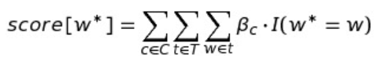
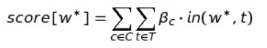
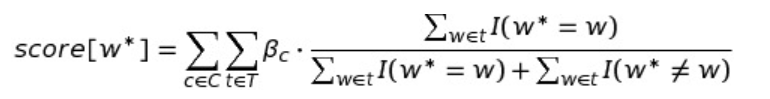
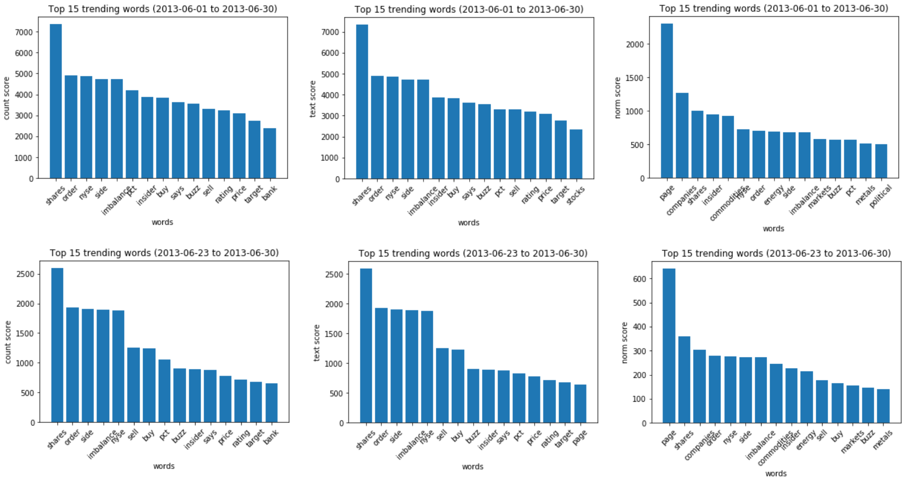
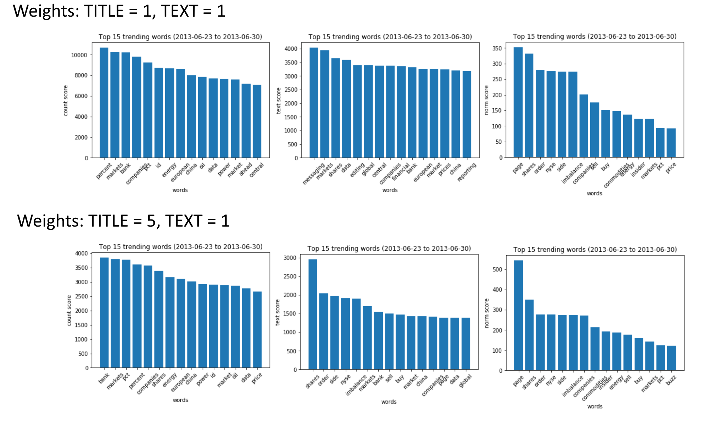

# word-trends
Detecting word trends in time-series text

Author: Arnold YS Yeung

Date: 2020-12-12

## Introduction
In this project, we developed a simple API for identifying word trends in text data over a specified date range. There are two main classes in this library:
- `TRArticles`: used for reformatting existing raw .csv data from the TR format to the standardized format
- `Articles`: used for pre-processing the data and computing the trend scores

`Articles` allows 3 different measures of trend for each word:
- `count`: based on the total occurrence of the word in all articles
- `text`: based on the total number of articles which contain the word
- `norm`: based on the relative importance of the word in the article and the number of articles containing the word

The experiment is ran in `./word_trends.ipynb`.

Please see below for further details.

## Methods

### Data Re-Formatting
Prior to pre-processing our data, we first need to convert the raw .csv data into a format that is usable.  We load this data into `TRArticles` for re-formatting.  

The following steps are taken for re-formatting:
1. Filter by the selected languages
2. Remove articles with duplicate entries.  That is, we join the text from `HEADLINE_ALERT_TEXT`, `ACCUMULATED_STORY_TEXT`, and `TAKE_TEXT` across all entries with the same `UNIQUE_STORY_INDEX`
3. Remove entries which do not refer to articles (e.g., test entries, service updates)
4. Convert `PRODUCTS` and `TOPICS` into set of categories
5. We combine `ACCUMULATED_STORY_TEXT` and `TAKE_TEXT` into a single field. (From the dataset, it is unclear how these two fields differ. We assume that they are similar and can be concatenated.)
6. We rename the fields to correspond to the standardized format and drop unnecessary fields.

#### Assumptions
We make the following assumptions with the raw .csv data:
- all unique articles have a distinct `UNIQUE_STORY_INDEX`
- `HEADLINE_ALERT_TEXT` contains the title of the article and `ACCUMULATED_STORY_TEXT` and `TAKE_TEXT` both contains text of the article (and can be concatenated together).

### Data Pre-Processing
We then load the re-formatted data into `Articles` for our pre-processing.  

The following steps are taken for pre-processing:
1. Remove "noise" (e.g., special characters, URLs, HTML characters) within our text fields
2. Remove punctuations by replacing them with whitespace
3. Tokenize the text within the text fields
4. Remove stop words

#### Future Work
Additional pre-processing steps for future versions include:
1. Add Part-of-Speech markers (to be implemented in future versions)
2. Lemmatize tokens (to be implemented in future versions)

### Trend Calculation

The trend score for each word is computed over the selected columns of the dataframe (e.g., `TITLE`, `TEXT`). The user may specify an importance weighting of each column, such that the score achieved within each column would be scaled to the weights.  For example, the weight of `TITLE` may be 5 times greater than the weight of `TEXT`, assuming that the title of articles contain the most important words relevant to the article.

There are 3 methods of calculating the trend for each word within the date range.

#### Count
In the `count` method, we take the total number of occurrences of the token within all texts in the date range.  That is,

where C = columns, T = texts in the column, w = word in text, and beta_c = the weight of the column.

This method naively assumes that the more occurrence of a word, the more trending it is. However, it is susceptible to issues such as an overabundance of a single word in one text.

#### Text
In the `text` method, we mitigate for a single text having an overly large influence by counting the number of texts where the token occurs. The frequency of the token within each text is not accounted for.  That is,

where C = columns, T = texts in the columns, beta_c = the weight of the column, and in(a, b) returns 1 if a in b and 0 if a not in b.

While this method does mitigate a single text from having an unfairly large influence on a score, it fails to measure the relative importance of the word within the text.

#### Norm
In the `norm` method, we normalize the occurrence of a given word in a given text by the number of words in the text. For each text, a given word would have a score ranging from 0 to 1, where the score would be equivalent to the percentage of words in the text that is the given word.

This method accounts for the relative importance of a word in a text, but gives equal weighting to all texts.

#### Future Work
Currently, this API only allows selection within a certain date range. Additional features may include selection of text based on their `TOPICS` or `PLATFORMS`/`PRODUCTS`.  This would require a mask in the Pandas DataFrame, similar to what has been done for the date range.

Additional trend measures may also involve converting words to latent vectors (e.g., word2vec) and using cosine similarity to find similar words.  We can then use clustering to identify top relevant topics and use prototypes to select words that best represent each of the top clusters.

## Results and Analysis

Using only text from the `TITLE` column, we observe that while the ranking of the top words are vary slightly, they are largely the same. This may be due to the fact that text from the `TITLE` column (i.e., headlines) generally only contain a low number (e.g., one) of each unique word. As a consequence, the output of the three methods would be largely the same.  

Interestingly, we observe `page` as ranking first in the `norm` method, but not ranking at all for the other two methods. While `page` may possibly be a stop word, it may also a word which occurs multiple times in headlines, hence achieving a high `norm` score.  Further investigation into `page` and whether it should be a stop word (or is a marker for a non-article entry) is necessary.

We also observe that while there is slight differences between the ranking of the top words for the whole month of June 2013 and the last week of June 2013, the top words themselves are largely the same.  This suggests that the articles are generally focused on these words (and topics), regardless of the date range. Overall, from observing these top words, this dataset typically contains topics involving commerce and politics.

When we include the text from the `TEXT` column with those from the `TITLE` column, we observe change in the top trending words. This change is more prevalent when the weights between `TITLE` and `TEXT` are more balanced (weights are 1 to 1) and is obvious in the `text` method, since it does not take into account the number of words within a text. 

Because the `count` method counts the total number of occurrences, because the text in `TEXT` is typically much longer than the text in `TITLE`, the `count` method would typically favour the column with the longer texts (i.e., `TEXT`), and greater weight imbalance would be needed to mitigate this trade-off.  The `norm` method, however, takes the relative importance of each word in its corresponding text.  As a result, the `norm` method tends to balance columns with different text lengths.  

We see this in the results, where the top words for the `count` method are very different when `TEXT` is included, whereas the top words for the `norm` method are still similar when `TEXT` is included.

### Summary

We used 3 different methods to measure the trends of words within articles. We found that, while observing both titles and body text, the `count` method tends to favour the body text due to its longer length. Both the `text` and `norm` methods disregard the length of the texts between the title and the body text.  However, the `norm` methods seems to be less influenced by weighting of different columns, due to measuring the relative importance of words within its corresponding text. The `text` method appears to be more influenced by weighting of different columns, especially when the columns have different text lengths.

## API
Aside from <a href="https://pandas.pydata.org/">Pandas</a>, all libraries used should be standard.
This API mainly comprises of 3 files:
- `tr_preprocessing.py` which contains the `TRArticles` class used for re-formatting a specific data format (i.e., TR)
- `articles.py` which contains the standard `Articles` class used for pre-processing the text data and computing trend measures
- `utils.py` which contains additional functions which are available for use with the API and is used by the other two files

An example of using this API is in `word_trends.ipynb`.

